# Parameter update of Hindmarsh-Rose model

By Sergio Hidalgo

## Index
  - [Introduction](#introduction)
  - [Parameters](#parameters)
  - [Contrast](#contrast)
    - [Old model vs new model](#old-model-vs-new-model)
    - [Old synapsis vs new synapsis](#old-synapsis-vs-new-synapsis)
      - [Positive presynaptic current](#positive-presynaptic-current)
      - [Negative presynaptic current](#negative-presynaptic-current)
      - [Positive presynaptic current in all variables](#positive-presynaptic-current-in-all-variables)
 
## Introduction
In this document the differences between the Hindmarsh-Rose model and the same model but with the addition of the parameter $v$ (and the consecuent modification of $S$)

## Parameters
The parameters choosed are based on the file *"HRmod.pdf"* inside the directory **`resources/`**, being $v=0.1$, $e=3.281$, $\mu=0.0021$ and $S=1.0$.

The values for the sinápsis $S_{fast}=0.44$, $V_{fast}=-1.66$, $E_{syn}=-1.92$ are obtained from **Table 2** and $gfast_{1}=0.241$ and $gfast_{2}=0.186$ from **Table 3** of the file *"pract3-15.pdf"* in the same directory previously mentioned .

## Contrast
Multiple executions have been realized for comparing the implementation of the synapsis and the new parameter, modifying the value of the variable $z$. The new fórmula for this variable is the result of the following equation:
$$
z(t)+ \Delta t\mu(-vz(t)+S(x(t)+1.6))
$$

Which is the resoult of resolving this equation:
$$
\frac{1}{\mu}\frac{dz(t)}{dt}=-vz(t)+S(x(t)+1.6)
$$

By the definition of derivative:
$$
\frac{df(t)}{dt} \approx \frac{f(t+\Delta t)-f(t)}{\Delta t} 
$$

### Old model vs new model

By assigning $v=1$ and keeping $S=4.0$ we have the same results as before:

Old regular simulation            |  Old regular simulation continue   
:-------------------------:|:-------------------------:
 |  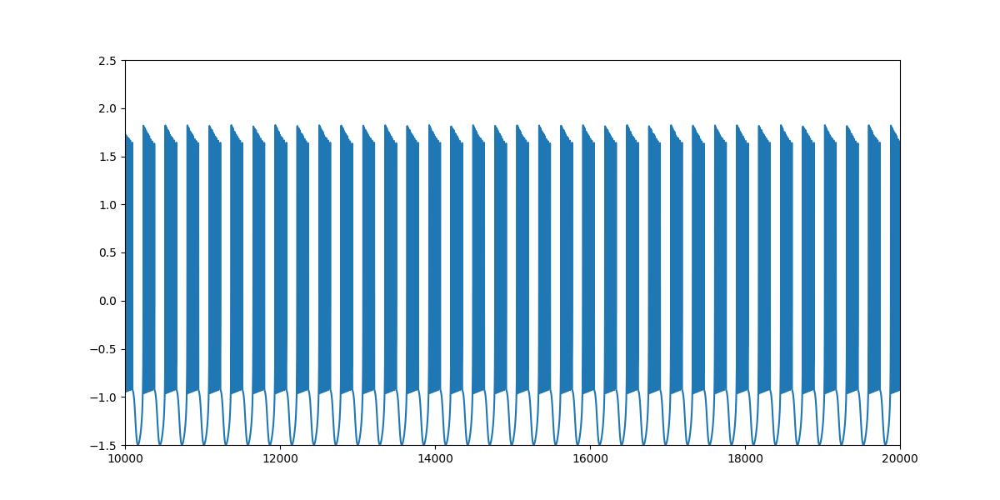

Old chaotic simulation         |  Old chaotic simulation continue
:-------------------------:|:-------------------------:
 |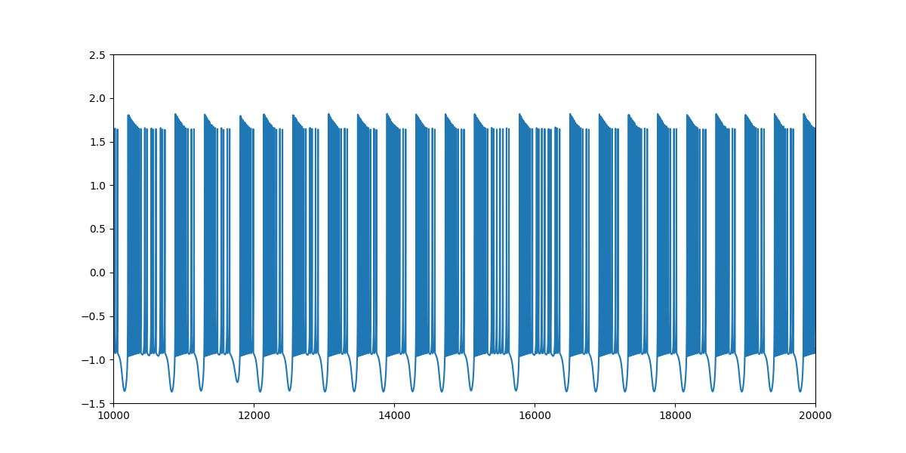

By changing $v=1 \Rightarrow v=0.1$ and $S=4.0 \Rightarrow S=1.0$ we have:

New regular simulation            |  New regular simulation continue   
:-------------------------:|:-------------------------:
 |  

New chaotic simulation         |  New chaotic simulation continue
:-------------------------:|:-------------------------:
 | 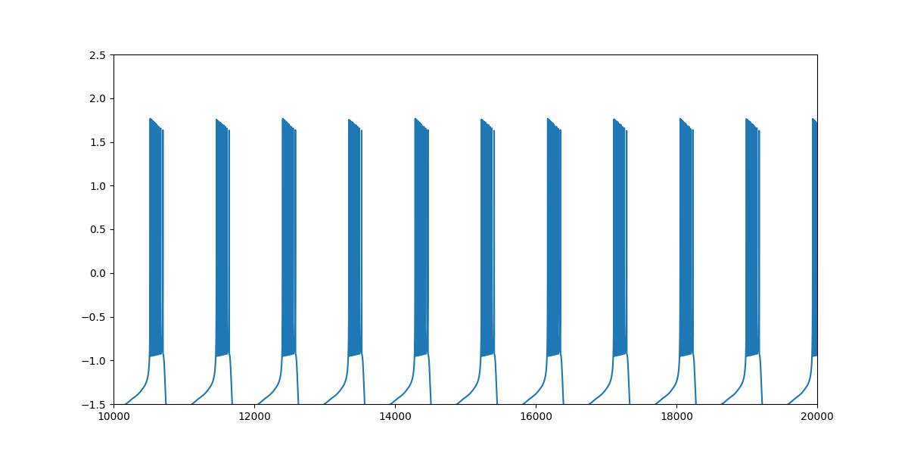

### Old synapsis vs new synapsis

Here are the results of the synapsis between the old model and the new model.

#### Positive presynaptic current

Here the synapis was calculated over $x$ variable with positive presynaptic current: 
$$
x(t+1)=x+\Delta t(y(t)+3x^{3}(t)-x^{2}(t)-z(t)+e+I_{syn})
$$

Old regular synapsis simulation            |  Old regular synapsis simulation continue   
:-------------------------:|:-------------------------:
 | 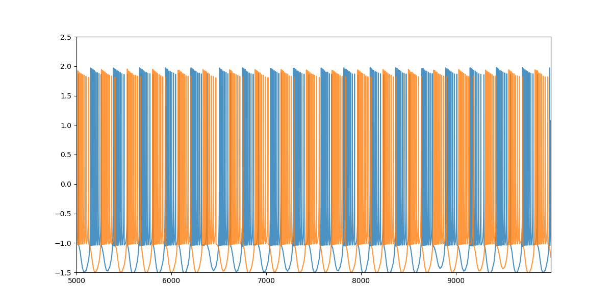

Old chaotic synapsis simulation         |  Old chaotic synapsis simulation continue
:-------------------------:|:-------------------------:
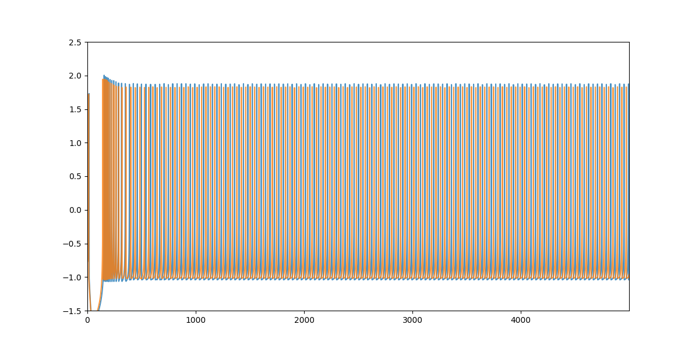 | 

By changing $v=1 \Rightarrow v=0.1$ and $S=4.0 \Rightarrow S=1.0$ we have:

New regular synapsis simulation            |  New regular synapsis simulation continue   
:-------------------------:|:-------------------------:
 |  

New chaotic synapsis simulation         |  New chaotic synapsis simulation continue
:-------------------------:|:-------------------------:
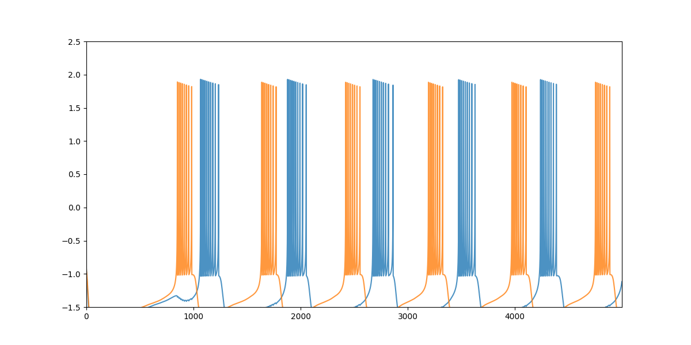 | 

#### Negative presynaptic current

Here the synapis was calculated over $x$ variable with negative presynaptic current: 
$$
x(t+1)=x+\Delta t(y(t)+3x^{3}(t)-x^{2}(t)-z(t)-e-I_{syn})
$$

Old regular synapsis simulation            |  Old regular synapsis simulation continue   
:-------------------------:|:-------------------------:
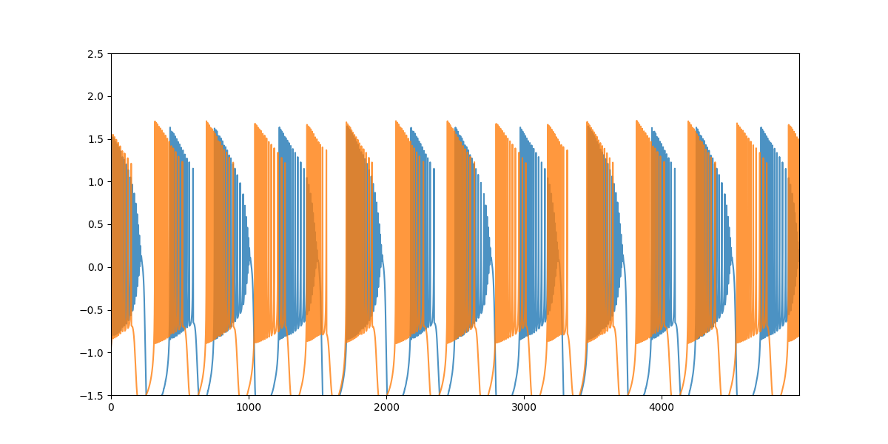 | 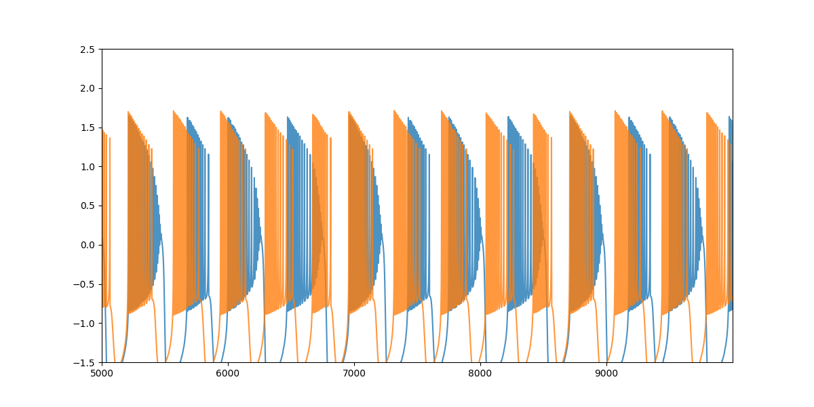

Old chaotic synapsis simulation         |  Old chaotic synapsis simulation continue
:-------------------------:|:-------------------------:
 | 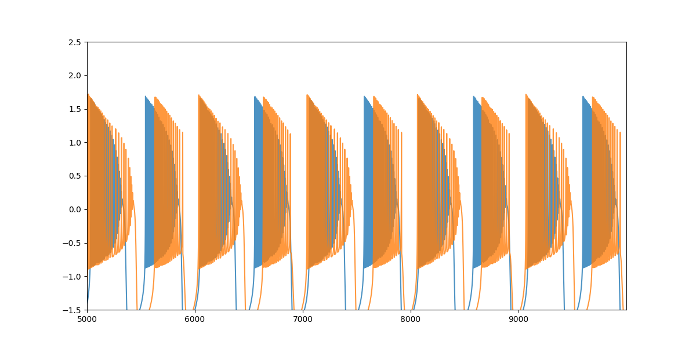

By changing $v=1 \Rightarrow v=0.1$ and $S=4.0 \Rightarrow S=1.0$ we have:

New regular synapsis simulation            |  New regular synapsis simulation continue   
:-------------------------:|:-------------------------:
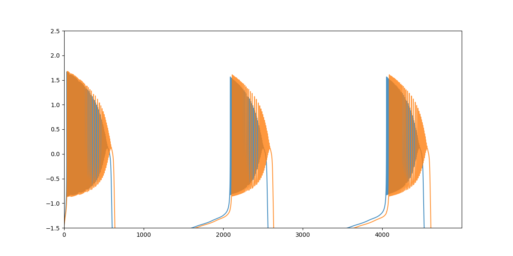 |  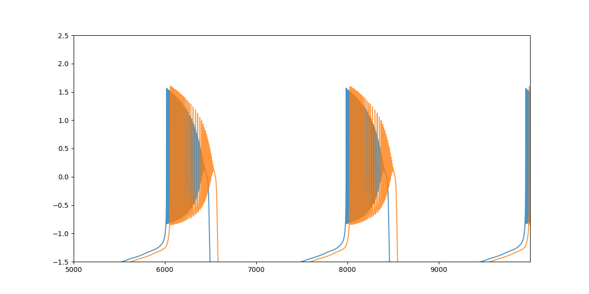

New chaotic synapsis simulation         |  New chaotic synapsis simulation continue
:-------------------------:|:-------------------------:
 | 

#### Positive presynaptic current in all variables

Here the synapis was calculated over $x$, $y$ and $z$ variables with positive presynaptic current: 
$$
x(t+1)=x(t)+\Delta t(y(t)+3x^{3}(t)-x^{2}(t)-z(t)-e+I_{syn})
$$
$$
y(t+1)=y(t)+\Delta t(1 - 5 x^{2} - y(t) + I_{syn})
$$
$$
z(t+1)=z+\Delta t\mu(-vz(t)+S(x + 1.6) + I_{syn})
$$

Old regular synapsis simulation            |  Old regular synapsis simulation continue   
:-------------------------:|:-------------------------:
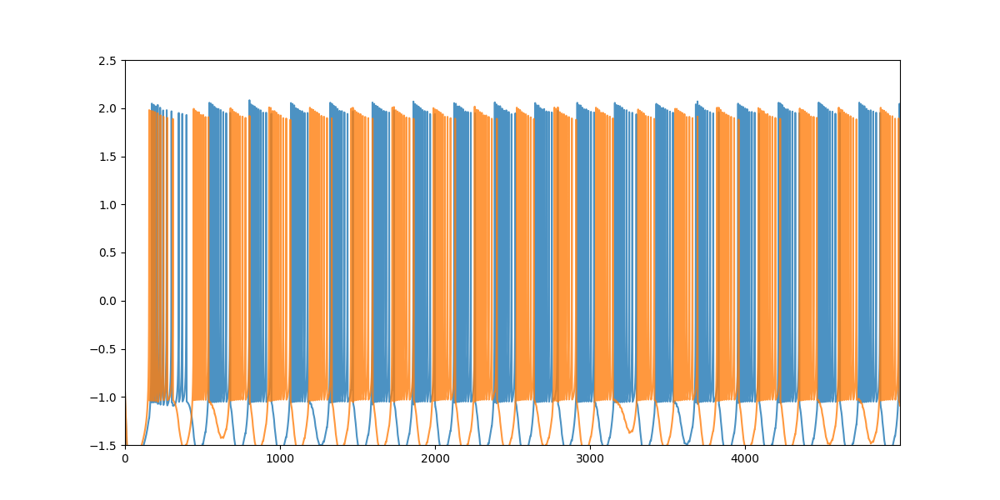 | 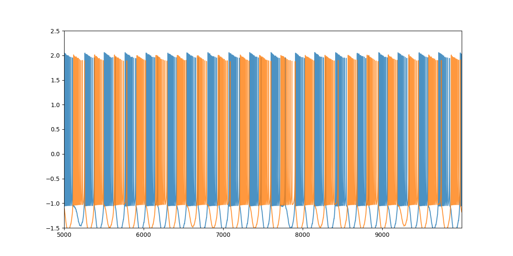

Old chaotic synapsis simulation         |  Old chaotic synapsis simulation continue
:-------------------------:|:-------------------------:
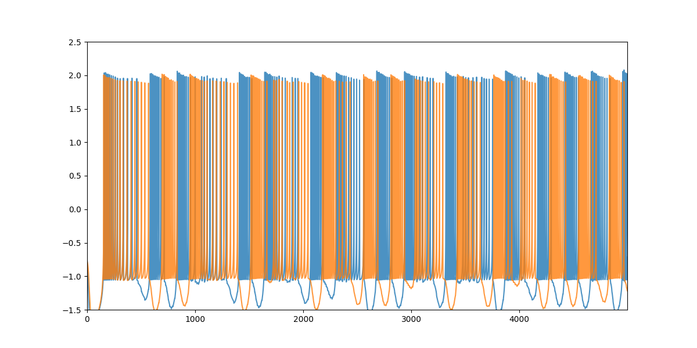 | 

By changing $v=1 \Rightarrow v=0.1$ and $S=4.0 \Rightarrow S=1.0$ we have:

New regular synapsis simulation            |  New regular synapsis simulation continue   
:-------------------------:|:-------------------------:
 |  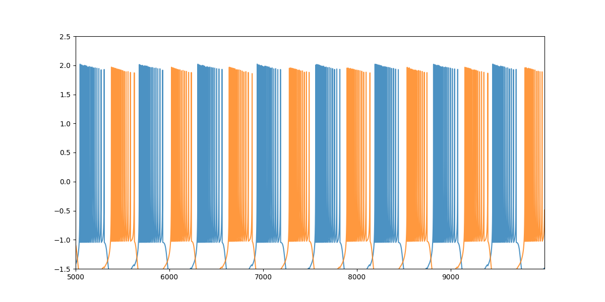

New chaotic synapsis simulation         |  New chaotic synapsis simulation continue
:-------------------------:|:-------------------------:
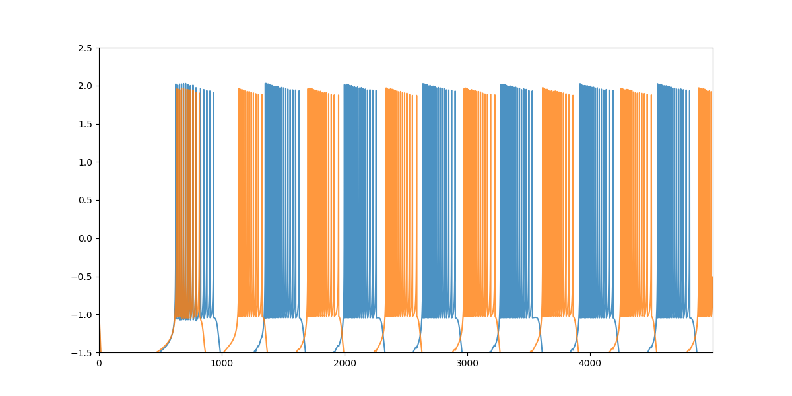 | 
