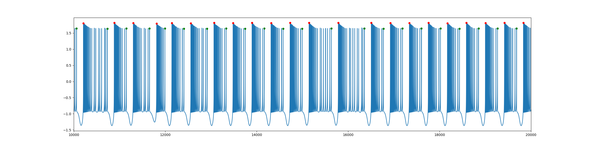
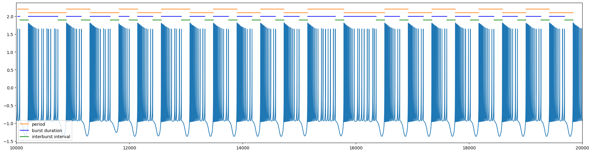

# Spike analysis

By Sergio Hidalgo

## Index
  - [Introduction](#introduction)
  - [Old model](#old-model)
    - [Old model](#old-model)

## Introduction
This document shows a provisional algorithm to analyize the nature of the spikes in a model, the model used in this case is the Hindmarsh-Rose model, with the base parámeters.

## Old model

Chaotic simulation first spike and last spike detection      |
:-------------------------:|
 |

Chaotic simulation intervals      |
:-------------------------:|
 |
