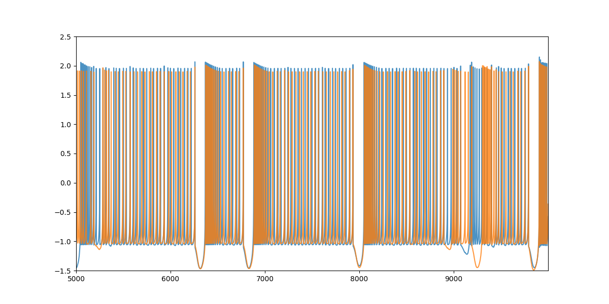
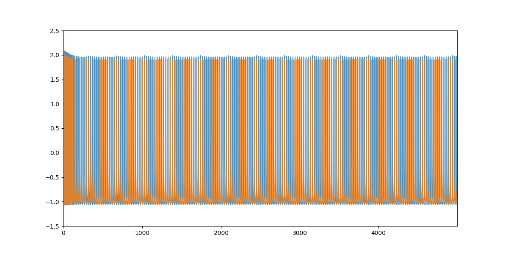

# Fast Synapsis Hindmarsh-Rose

By Sergio Hidalgo

## Index
- [Introduction](#introduction)
- [Parameters](#parameters)
- [Graphs](#graphs)

## Introduction
This document shows the results from two programs that simulates the fast synapis between two Hindmarsh-Rose neurons

## Parameters
The parameters choosed are inspired on the article [Network Stability from Activity-Dependent Regulation of Neuronal Conductances](https://direct.mit.edu/neco/article-abstract/11/5/1079/6277/Network-Stability-from-Activity-Dependent?redirectedFrom=fulltext)

The **Table 3** of the article shows the values of maximal conductance, and we can see that *LP* neuron and *PY* neuron have a both values between them. 
So neuron1 will be *LP* and neuron2 *PY*, being $gfast_{1}=0.02$ and $gfast_{2}=0.005$.

It is also mentioned on the same article that $S_{fast}=0.2mV$ and $V_{fast}=-50mV$, this values (passed to V) are equal to $S_{fast}=0.0002mV$ and $V_{fast}=-0.05mV$.

## Graphs
On the following pages are the graphs for the different simulations:

