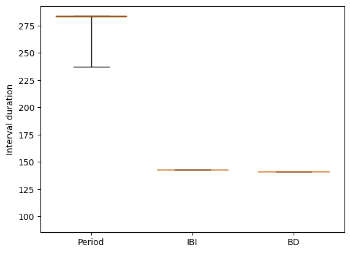
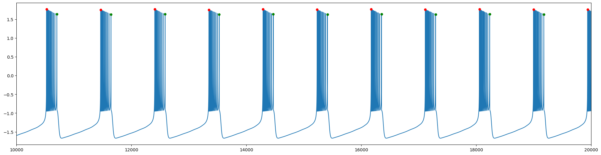
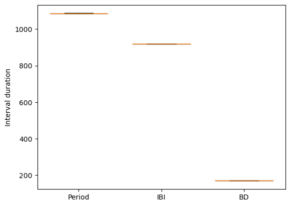
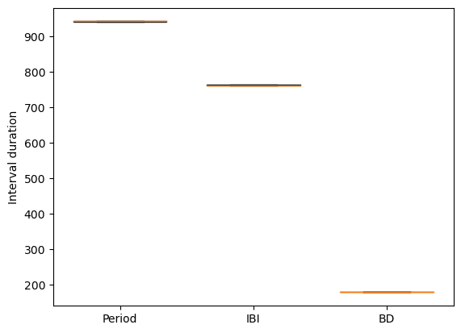
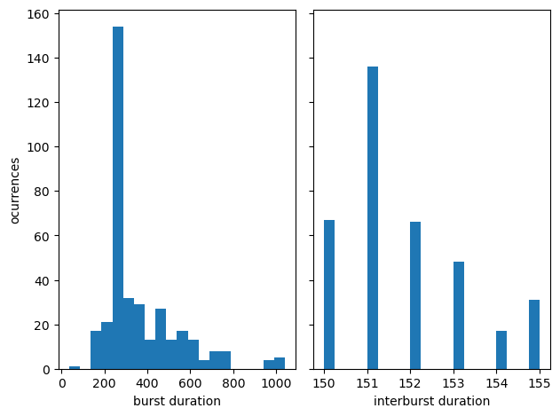
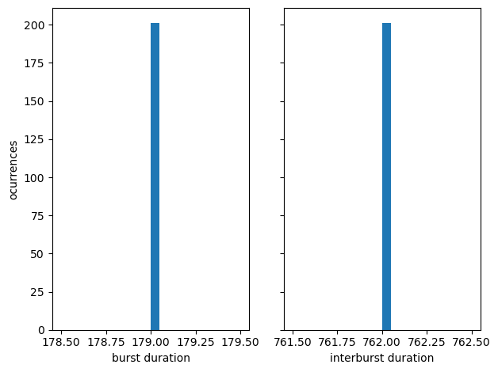

# Spike analysis

By Sergio Hidalgo

## Index
  - [Introduction](#introduction)
  - [Strategy](#strategy)
  - [Problems on the practical implementation](#problems-on-the-practical-implementation)
  - [Algorithm](#algorithm)
  - [Results](#results)
    - [Old model](#old-model)
    - [New model](#new-model)
  - [Histograms](#histograms)


## Introduction
This document shows a provisional algorithm to analyze the nature of the spikes in a model, the models used in this case are the Hindmarsh-Rose model with $S=4$ and $v=1$ and the same model with $S=1$ and $v=0.1$, with both the regular and chaotic configuration.

## Strategy
The first approach to this problem is to get the points sign with the *derivative* (if it is **positive** is ascending, and if it's **negative** it's descending), checking the change of sign between some points.  If this sign changing is on a point bellow some tolerance, then a *"big valley"* (or **interbust interval**) have passed. Having this in mind we can catalog the two maximums that are aside from this interval, being the first maximum the last spike in the burst, and the second one the first spike in the actual burst.

## Problems on the practical implementation
There are two main problems to be solved. The first one is that the last spike its only detected when the first half of the interbust intervarl have passed, so there is no response window to respond in real time. The second one is the tolerance parameter, because it can vary from neuron to neuron, probably a heuristic to estimate the value is needed.

## Algorithm
The following implementation of the algorithm it's for data that have already occurred. This can be changed if the list of locations and flags are passed as arguments and returned at the end of the iterations (or if the loop it's infinite and instead of reading a array of data, it reads a pipeline or a file that gets updated).

The algorithm implementation in python:
```python
    x_data:np.ndarray = data[0]
    time_data:np.ndarray = data[1]

    firsts_location:list = []
    lasts_location:list = []

    last_point_valley:bool=True
    spike_marked:bool=True
    spike:int=-1


    for i in range (1, x_data.size):
        t_act = time_data[i-1]
        x_act = x_data[i-1]

        t_next =  float(time_data[i])
        x_next = float(x_data[i])
        t_diff = float(t_next - t_act)
            
        dx = float(x_next - x_act)/t_diff

        if i == 1:
            prev_sign= np.sign([dx])[0]


        dx_sign = np.sign([dx])[0]

        if dx_sign!=prev_sign and x_act <= tol: # here is identified the LAST spike (at the end of the Burst Duration)
            if spike_marked:
                lasts_location.append(spike) 
                spike_marked=False

            last_point_valley=True
        
        elif dx_sign!=prev_sign and last_point_valley:
            firsts_location.append(i-1) # here is identified the FIRST spike (at the begining of the Burst Duration)
            last_point_valley=False

        elif dx_sign!=prev_sign:
            spike = i-1
            spike_marked=True   

        prev_sign = dx_sign
        t_act = t_next
        x_act = x_next


    return (firsts_location, lasts_location)
```

As it can be seen in the algorithm, there are two main flags:

- **last_point_valley**: Indicates that the last point was an interburst interval. At the beginning it's set to `True` so the first spike is detected.
- **spike_marked**: Indicates that the last spike was marked on this iteration (so it doesn't get mix up with the first spikes, due to the nature of the iteration)


## Results
### Old model

Regular simulation first spike and last spike detection      |
:-------------------------:|
 |

Chaotic simulation first spike and last spike detection      |
:-------------------------:|
 |

Regular simulation intervals      |
:-------------------------:|
 |


Chaotic simulation intervals      |
:-------------------------:|
 |


Regular simulation durations      | Chaotic simulation durations |
:-------------------------:|:-------------------------:|
 | |

Here it can be seen that the period and the burst duration have more variation on the chaotic model, but the interburst interval doesn't change and neither leaves any time to other possible neurons to burst in **antiphase**.


### New model

Regular simulation first spike and last spike detection      |
:-------------------------:|
 |


Chaotic simulation first spike and last spike detection      |
:-------------------------:|
 |

Regular simulation intervals      |
:-------------------------:|
 |

Chaotic simulation intervals      |
:-------------------------:|
 |


Regular simulation durations      | Chaotic simulation durations |
:-------------------------:|:-------------------------:|
 | |

In contrast with the old model, here another neuron could be bursting within the interburst interval, but the variation and chaotic nature of the model is lost.


## Histograms

Regular simulation old model histogram      | Regular simulation new model histogram |
:-------------------------:|:-------------------------:|
 | 

The regular simulation, obviously generates same amount of intra and inter bursts. 

Chaotic simulation old model histogram   | Chaotic simulation new model histogram  
:-------------------------:|:-------------------------:|
 |  


In the chaotic simulation of the old model, the difference can be apreciated, tipically the interbursts have less duration than the bursts. 
