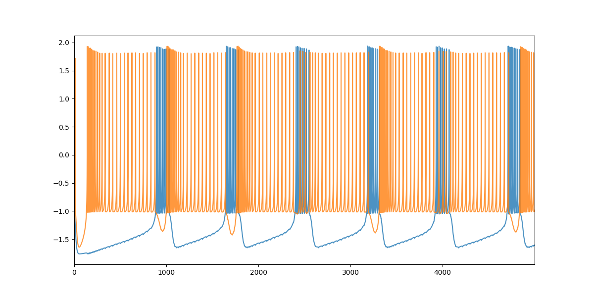
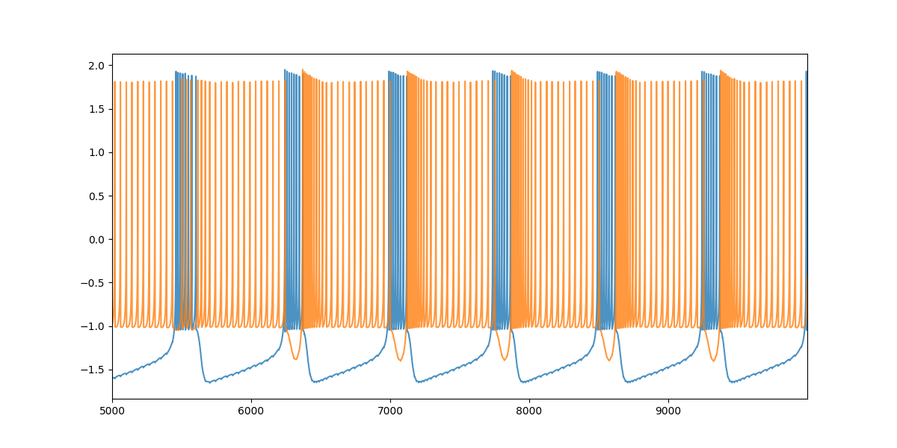

# Fast Synapsis between Hindmarsh-Rose models

By Sergio Hidalgo

## Index
  - [Introduction](#introduction)
  - [Parameters](#parameters)
  - [Graphs](#graphs)

## Introduction
This document shows the results for the fast synapis between two Hindmarsh-Rose neurons with different models (one the older, the other the new).

## Parameters
The parameters choosed are the same that the other doc, $v=0.1$, and $S=1.0$ for the new model and $v=1.0$, and $S=4.0$ for the old model .

## Graphs

Old model - new model simulation            |  Old model - new model simulation continue   
:-------------------------:|:-------------------------:
 |  

Old model - new model chaotic simulation        | Old model - new model chaotic simulation continue 
:-------------------------:|:-------------------------:
 |

